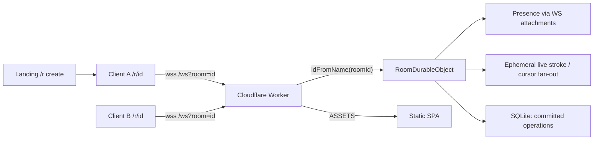
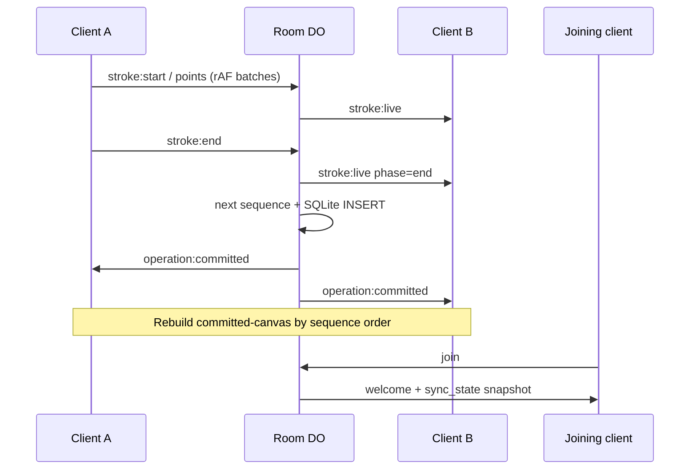

# Architecture

Status legend: **Implemented** vs **Planned**.

## Overview

Loomline is a room-scoped collaborative drawing app. Clients render locally with
the Canvas 2D API. Presence, live strokes, and durable ordered operations go
through a Cloudflare Worker that routes each room id to one Durable Object.

## Committed operation data flow (implemented)

## Why `idFromName(roomId)` is safe isolation

Cloudflare maps the string passed to `idFromName` through an internal hash to a
**unique Durable Object id**. Different room id strings never share that instance.

Verified in `test/rooms.test.ts`.

## Implemented

| Piece | Role |
| --- | --- |
| Landing / room client | Presence, cursors, live + committed sync |
| Canvas layers | `committed-canvas` = server ops; `live-canvas` = in-progress |
| Point batching | ≤ one `stroke:points` per animation frame |
| `RoomDurableObject` | Live fan-out + SQLite ordered ops + `sync_state` |
| Shared protocol | Validated versioned messages |

### Rendering layers (current)

1. **committed-canvas** — deterministic replay of `CommittedOperation`s ordered
   by server `sequence`. Dirty only when sync_state / operation:committed changes.
2. **live-canvas** — local active + awaiting-commit strokes, remote in-progress.
3. **cursor-layer** (DOM) — remote cursors.

Local finished strokes stay on the live layer until `operation:committed`
acknowledges them, then move into the committed store (no double paint).

### Storage

- Table `operations`: one row per completed stroke (`sequence` PK, full
  `points_json`).
- Schema created in the DO constructor via `blockConcurrencyWhile`.
- Live pointer points are never written as individual rows.

## Planned

- Global tombstone undo/redo
- Reconnect backoff + last-sequence resume (join already sends full sync_state)
- Payload rate limits / client-side 64-point chunking enforcement

## Explicit runtime note

This is **not** a Node.js server. The Worker runs on Cloudflare's edge JavaScript
runtime. Rationale: [DECISIONS.md](./DECISIONS.md).
