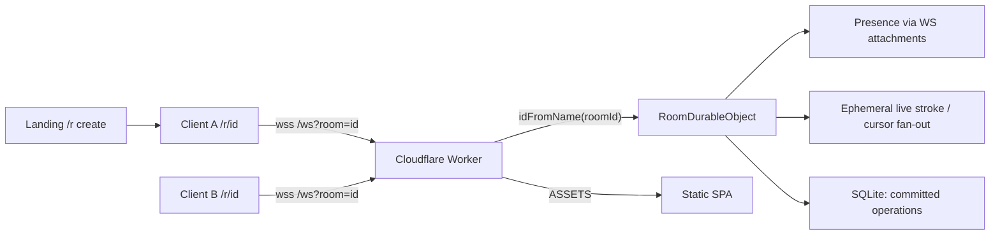
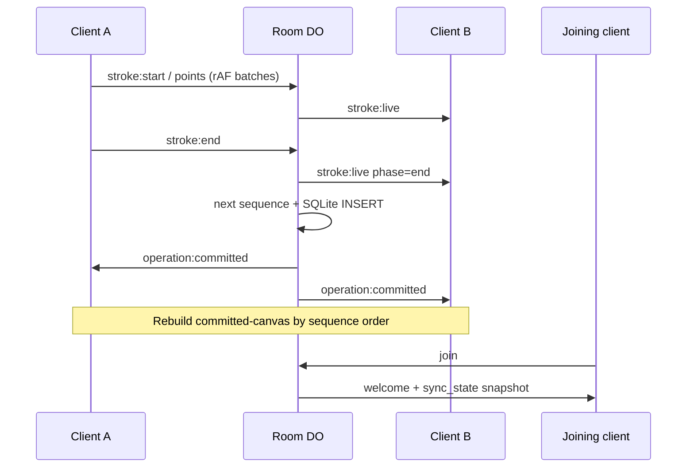
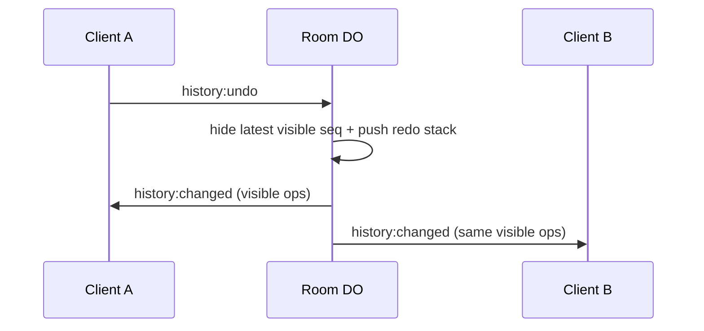

# Architecture

Status legend: **Implemented** vs **Planned**.

## Overview

Loomline is a room-scoped collaborative drawing app. Clients render locally with
the Canvas 2D API. Presence, live strokes, and durable ordered operations go
through a Cloudflare Worker that routes each room id to one Durable Object.



## Committed operation data flow (implemented)



## Why `idFromName(roomId)` is safe isolation

Cloudflare maps the string passed to `idFromName` through an internal hash to a
**unique Durable Object id**. Different room id strings never share that instance.

Verified in `test/rooms.test.ts`.

## Implemented

| Piece | Role |
| --- | --- |
| Landing / room client | Presence, cursors, live + committed sync |
| Canvas layers | `committed-canvas` = server ops; `live-canvas` = in-progress |
| Point batching | ≤ one `stroke:points` per animation frame |
| `RoomDurableObject` | Live fan-out + SQLite ops + tombstones + stall alarm + `sync_state` |
| Shared protocol | Validated versioned messages |
| Client reconnect | Exponential backoff; full snapshot on re-join |

### Rendering layers (current)

1. **committed-canvas** — deterministic replay of **visible**
   `CommittedOperation`s ordered by server `sequence`. Dirty on sync_state /
   operation:committed / history:changed.
2. **live-canvas** — local active + awaiting-commit strokes, remote in-progress.
3. **cursor-layer** (DOM) — remote cursors.

Local finished strokes stay on the live layer until `operation:committed`
acknowledges them, then move into the committed store (no double paint).

### Storage

- Table `operations`: one row per completed stroke (`sequence` PK, full
  `points_json`). Never updated or deleted by undo/redo.
- Tables `history_hidden` / `history_redo_stack`: durable visibility + redo.
- Schema created in the DO constructor via `blockConcurrencyWhile` (safe after
  hibernation wake). Live map starts empty on wake; constructor re-arms the
  stall alarm from `live_stroke_expiry` if any rows remain.
- Live pointer **points** are never written as SQLite rows.
- Table `live_stroke_expiry`: participant/stroke/room + `expires_at` only, so a
  post-hibernation alarm can still clear peer overlays (`LIVE_STROKE_STALL_MS`).

## Planned

- Payload rate limits / client-side 64-point chunking enforcement
- Sticky participant identity across reconnect (optional polish)

## Reconnect / hibernation (implemented)

```mermaid
sequenceDiagram
  participant B as Client B
  participant DO as Room DO
  Note over B: Unexpected WS close
  B->>B: Reconnecting… exponential backoff
  B->>DO: new WS + join
  DO->>B: welcome + sync_state (visible ops)
  Note over B: Replace committed store; skip duplicate sequences
```

- Hibernation retains healthy sockets at the platform layer; Loomline still shows
  reconnect UI for real drops and refreshes.
- Full snapshot on join (not last-seq delta) because undo tombstones change
  visibility independently of sequence head.

## Global tombstone undo/redo (implemented)

History is **server-owned and global**. The `operations` table is append-only.

| Store | Role |
| --- | --- |
| `operations` | Every completed stroke forever (`sequence` PK) |
| `history_hidden` | Sequences currently not painted |
| `history_redo_stack` | LIFO of redoable undos (`position` + `sequence`) |

### Worked example

Start: ops `{1:A, 2:B, 3:C}` all visible. Redo stack empty.

1. **Undo** → tombstone `3`. Hidden `{3}`. Redo stack `[3]`. Visible `{1:A, 2:B}`.
2. **Undo** → tombstone `2`. Hidden `{3,2}`. Redo stack `[3,2]`. Visible `{1:A}`.
3. **Redo** → pop `2`. Hidden `{3}`. Redo stack `[3]`. Visible `{1:A, 2:B}`.
4. **Commit D** as sequence `4` → **clear redo stack**. Hidden still `{3}` so `C`
   stays gone. Visible `{1:A, 2:B, 4:D}`. A further **Redo** is a no-op.
5. Clients rebuild committed-canvas from the visible list in `history:changed`
   or `sync_state` (joiners never see tombstoned strokes).

Live strokes never enter `operations`, so they are not undoable.



## Explicit runtime note

This is **not** a Node.js server. The Worker runs on Cloudflare's edge JavaScript
runtime. Rationale: [DECISIONS.md](./DECISIONS.md).
