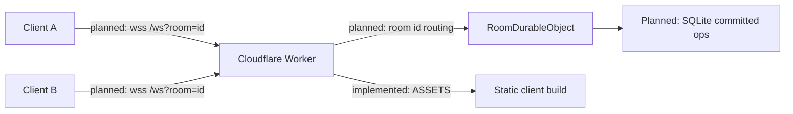

# Architecture

Status legend: **Implemented** vs **Planned**.

## Overview

Loomline is a room-scoped collaborative drawing app. Clients render locally with
the Canvas 2D API and will synchronize through a Cloudflare Worker that routes
each room to one Durable Object.

## Implemented

| Piece | Role |
| --- | --- |
| Vite client (`client/`) | Responsive shell with toolbar/status placeholders |
| Canvas layers | CSS-stacked `committed-canvas` + `live-canvas`; separate buffers |
| Dirty paint API | `LayeredCanvasSurface` paints a layer only when marked dirty |
| Worker (`worker/index.ts`) | Serves `/api/health` and static assets via `env.ASSETS` |
| `RoomDurableObject` (`worker/room.ts`) | Binding/class skeleton only |
| Wrangler assets | `dist/client` uploaded/served with the Worker on one origin |

### Request path (current)

1. Browser requests a path on the Worker origin.
2. `/api/health` returns JSON service status.
3. All other paths are delegated to `env.ASSETS.fetch(request)` (built Vite output).
4. Durable Object stubs exist in `env.ROOM` but are not routed from HTTP/WebSocket yet.

### Rendering layers (current)

1. **committed-canvas** — reserved for deterministic replay of server-sequenced operations. Empty until history lands.
2. **live-canvas** — reserved for ephemeral local/remote in-progress strokes. Empty until drawing lands.

These layers must never paint into each other’s buffers. There is no permanent
render loop; a layer paints on dirty + `requestAnimationFrame`. DPR-aware resize
updates both backing stores together.

## Planned system design

### Room lifecycle (planned)

1. Landing page creates/opens a short room id URL.
2. Worker upgrades WebSocket and routes by room id to `env.ROOM.idFromName(roomId)`.
3. DO accepts the socket, sends a snapshot, then streams live + committed events.
4. Idle rooms may hibernate; constructor/reload restores durable state from SQLite.
5. Different room ids map to different DO instances — no shared history.

### Persistence (planned)

- Persist only completed strokes as operation records (not one row per pointer point).
- Store room metadata and undo tombstones in Durable Object SQLite.
- Live strokes remain ephemeral and may expire safely.

### Reconnect / hibernation (planned)

- Client reconnects with last-seen sequence.
- Server returns snapshot/replay from durable state.
- Client ignores already-applied sequences.
- Hibernation is treated as real: in-memory-only state is never assumed to survive.

### Scaling path (planned, not claimed)

- Horizontal fan-out is per room (one DO coordinator per room).
- Large histories may later use optional Canvas checkpoints (stretch).
- Cross-region latency will be measured and documented, not promised up front.

## Explicit runtime note

This is **not** a Node.js server. The Worker runs on Cloudflare's edge JavaScript
runtime. Native WebSockets and TypeScript remain web-standard; the coordinator is
a Durable Object instead of a long-lived Node `ws` process. Rationale:
[DECISIONS.md](./DECISIONS.md).
