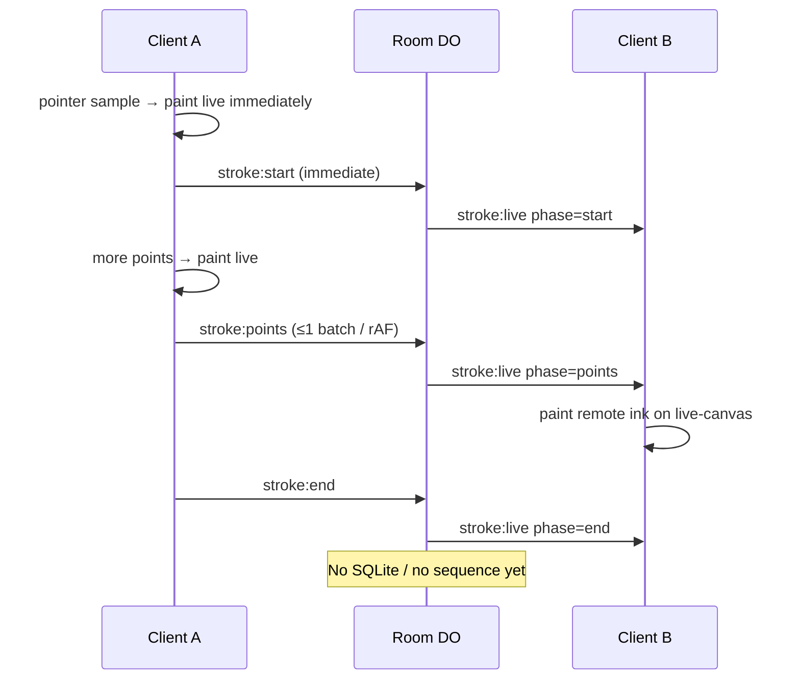

# Architecture

Status legend: **Implemented** vs **Planned**.

## Overview

Loomline is a room-scoped collaborative drawing app. Clients render locally with
the Canvas 2D API. Presence and live stroke fan-out go through a Cloudflare
Worker that routes each room id to one Durable Object.

## Live stroke data flow (implemented)

## Why `idFromName(roomId)` is safe isolation

Cloudflare maps the string passed to `idFromName` through an internal hash to a
**unique Durable Object id**. The Worker never shares one DO across different
room id strings: `idFromName("aaaa1111")` and `idFromName("bbbb2222")` yield
different ids and therefore different SQLite stores and WebSocket sets.

We do **not** use `newUniqueId()` for rooms, because clients must reconnect to
the same room by sharing the human room id in the URL.

Verified in `test/rooms.test.ts`: two room ids write distinct storage marks with
zero crossover.

## Implemented

| Piece | Role |
| --- | --- |
| Landing (`/`) | Create random 8-char room id or join by id → `/r/:roomId` |
| Room client | Presence, cursors, live remote strokes, local tools |
| Canvas layers | `committed-canvas` + `live-canvas`; dirty rAF paint |
| Local drawing | Brush/eraser/colour/width/clear; immediate local pixels |
| Point batching | `StrokePointBatcher` ≤ one `stroke:points` per animation frame |
| Worker | `/api/health`, `/ws?room=`, static assets |
| `RoomDurableObject` | Join/presence + validated live stroke / cursor broadcast |
| Shared | Room helpers + `parseClientMessage` protocol validation |

### Request path (current)

1. `/` and `/r/:roomId` served as SPA assets.
2. Client opens `ws(s)://origin/ws?room=<id>` and sends `join`.
3. Worker validates room id → `env.ROOM.idFromName(roomId)` → DO upgrade.
4. DO assigns participant id/colour, stores small attachment metadata, broadcasts
   `presence` on join/leave.
5. After join, clients stream `stroke:*` / `cursor`; DO validates and fans out
   `stroke:live` / `cursor` to other sockets in the room.

### Rendering layers (current)

1. **committed-canvas** — finished **local** strokes plus provisional finished
   remote strokes (client-side retention only until durable ops exist).
2. **live-canvas** — in-progress local stroke + remote in-progress strokes.
3. **cursor-layer** (DOM) — remote cursor dots/labels; not painted into Canvas
   buffers.

Local drawing always paints before the network send. Remote in-progress ink
never writes into the committed buffer until `stroke:live` `phase: "end"`.

## Planned

### Drawing sync / persistence

- Durable `operation:committed` with SQLite and authoritative sequence
- Global tombstone undo/redo
- Snapshot/replay on reconnect

### Scaling path (planned, not claimed)

- One DO coordinator per room; measure before claiming multi-region numbers

## Explicit runtime note

This is **not** a Node.js server. The Worker runs on Cloudflare's edge JavaScript
runtime. Rationale: [DECISIONS.md](./DECISIONS.md).
