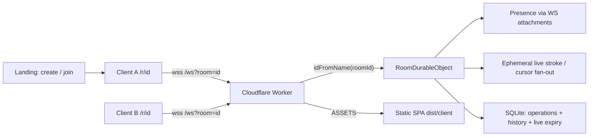
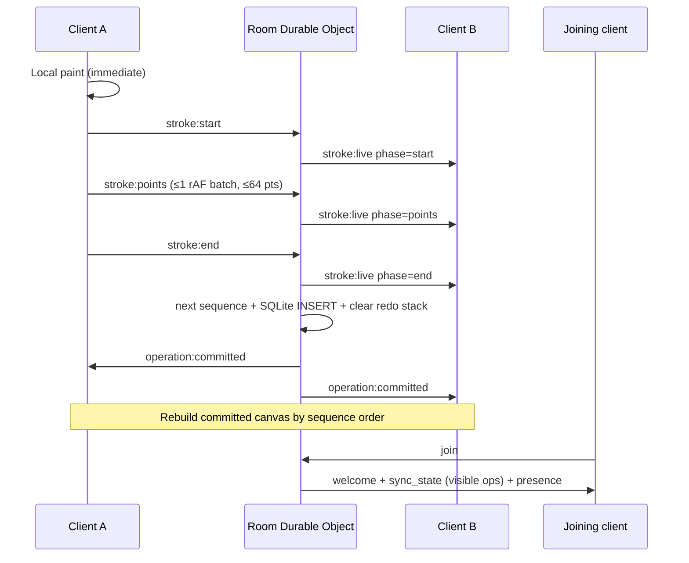
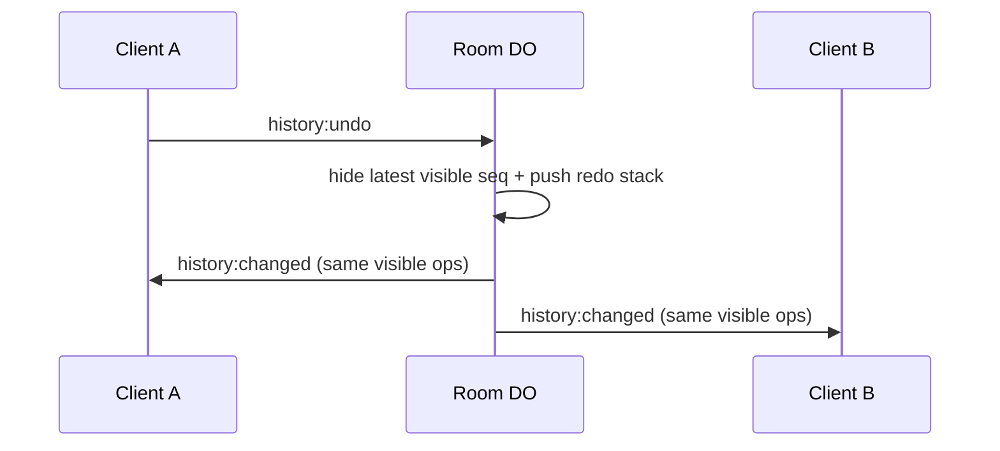

# Architecture

Loomline is a room-scoped collaborative drawing app. Clients paint with the
native Canvas 2D API. Presence, live strokes, and durable ordered operations
travel over a same-origin WebSocket to a Cloudflare Worker that routes each
room id to **one** Durable Object.

Production origin: <https://loomline.kolasanivenkat2.workers.dev>  
Static assets, `/api/*`, and `wss` share that origin.

This is **not** a Node.js server. The Worker runs on Cloudflare's edge JavaScript
runtime. Rationale: [DECISIONS.md](./DECISIONS.md) D1.

## System diagram



## Data flow (committed stroke)



## Why `idFromName(roomId)` isolates rooms

Cloudflare maps the string passed to `idFromName` through an internal hash to a
**unique Durable Object id**. Different room id strings never share that
instance. Loomline validates room ids as `/^[a-z0-9]{8}$/` before routing.

Verified in `test/rooms.test.ts`.

## Conflict resolution (Durable Object single-threaded model)

Overlapping strokes are **valid composition**, not errors. There is no pixel
merge, OT, or CRDT.

What prevents conflicting orders:

1. **One Durable Object per room** is the only writer that assigns `sequence`.
2. Cloudflare runs that object's handlers with **single-threaded concurrency
   control** for the instance: messages for the same room are processed one at a
   time (constructor schema setup also uses `blockConcurrencyWhile`).
3. On `stroke:end` or `canvas:clear`, the DO computes `sequence = MAX(sequence)+1`,
   inserts **one** SQLite row, then broadcasts the same
   `operation:committed` to every joined socket.
4. Clients paint visible ops in ascending sequence. Later sequence paints later.
   Two clients finishing strokes “at the same wall-clock time” still get a total
   order because only one commit handler runs at a time inside the room DO.

What this is **not**:

- Not last-writer-wins on pixels.
- Not client-assigned order.
- Not a claim that live overlays are durable — mid-stroke disconnect abandons
  the provisional stroke; it never receives a sequence.

## Complete WebSocket protocol table

Transport: native browser `WebSocket` to same origin.  
Path: `/ws?room=<roomId>`.  
Every JSON message includes `type`, `protocolVersion` (`4`), and `roomId`.
All coordinates are normalized (see [Coordinate space](#coordinate-space)).

| Message | Direction | Meaning |
| --- | --- | --- |
| `join` | client → server | Enter room; optional `displayName` (server trims/caps to 24 chars) |
| `welcome` | server → client | Assigned `participantId`, colour, display name |
| `sync_state` | server → client | Visible committed ops + `sequenceHead` + `canUndo` / `canRedo` |
| `presence` | server → all | Full participant list for the room |
| `stroke:start` | client → server | Begin provisional stroke (`strokeId`, tool, colour, width, first point) |
| `stroke:points` | client → server | Batched points (1–64); client sends ≤ one batch per animation frame |
| `stroke:end` | client → server | Finish provisional stroke; may produce one durable stroke op |
| `stroke:live` | server → peers | Fan-out start / points / end for live overlay (not to author for own ink) |
| `shape:rect` | client → server | Commit one finished rectangle (`shapeId`, colour, width, normalized `start`/`end`); no live intermediate frames |
| `canvas:clear` | client → server | Request one room-global durable clear operation |
| `operation:committed` | server → **all** | Durable op with authoritative increasing `sequence` (`stroke` / `rect` / `clear`) |
| `history:undo` | client → server | Tombstone latest **visible** completed op |
| `history:redo` | client → server | Restore newest redoable tombstone |
| `history:changed` | server → **all** | Visible op set after undo/redo; clients rebuild |
| `cursor` | client → server → peers | Ephemeral idle pointer position (suppressed while drawing) |
| `ping` | client → server | RTT probe with `clientTime` |
| `pong` | server → client | Echoes `clientTime` + `serverTime` |
| `error` | server → client | Recoverable typed failure; room stays alive |

### Protocol extensibility

`shape:rect` was added without redesigning sequencing, persistence, or undo.
It is another `operation_type` in the same append-only SQLite log: the Durable
Object still assigns one increasing `sequence`, broadcasts
`operation:committed`, and undo/redo tombstone visibility exactly as for
strokes. Only the payload differs (two corners instead of a freehand point
list), and drag preview stays local so the live WebSocket path is unused.

### Payload / rate limits (enforced)

| Limit | Value |
| --- | --- |
| Text frame size | ≤ 16_384 **UTF-8 bytes** (`TextEncoder`) before parse |
| `strokeId` | 1–64 characters |
| Points per `stroke:points` | 1–64 |
| Stroke width | integer 1–32 |
| Colour | `#RRGGBB` |
| Display name | optional; trim/cap 24; blank → `Artist-<id prefix>` |
| Abuse frames / participant / 1s | ≤ 120 (binary / oversized / malformed / parse failures only) |

Typed `error` codes include: `invalid_json`, `payload_too_large`,
`unsupported_type`, `protocol_mismatch`, `invalid_payload`, `rate_limited`,
`not_joined`, `room_mismatch`, `already_joined`, `stroke_active`,
`unknown_stroke`, `stroke_expired`. Full schemas and examples:
[PROTOCOL.md](./PROTOCOL.md).

### HTTP helpers

| Endpoint | Behavior |
| --- | --- |
| `GET /api/health` | `{ ok, service: "loomline", phase: "observability" }` |
| `GET /api/room-metrics?room=` | DO head snapshot for load scripts |
| Static assets via `ASSETS` | Landing + SPA `/r/:roomId` |

## Coordinate space

Points are pixels only at the two edges of the system. Everything in between —
stroke geometry, durable operations, `stroke:live` fan-out, `cursor` frames —
holds fractions of the canvas box (`client/src/canvas/normalized-coords.ts`).

| Stage | Space | Where |
| --- | --- | --- |
| Pointer event | CSS px relative to the canvas box | `LocalDrawingController.samplePointer` |
| Stroke / op / wire | normalized `0–1` | `Stroke.points`, `StrokePoint` |
| Paint | CSS px of the box current at paint time | `paintStroke(ctx, stroke, space)` |
| Remote cursor DOM | CSS px of the overlay box current now | `RemoteCursorLayer` |

Consequences: replay follows the canvas across resize and rotation, peers with
different window sizes see the same drawing, and reflow is **per axis** — a
re-shaped canvas keeps all ink visible and stretches it, rather than preserving
aspect ratio and pushing ink out of view. Stroke `width` stays in CSS pixels.

Resizing regenerates the bitmap; it never scales one. `applyBackingSize`
reassigns `canvas.width/height` to `cssSize × dpr` (which clears the buffer) and
both layers repaint from the normalized log. `ResizeObserver` covers box
changes; a `matchMedia('(resolution: Ndppx)')` listener covers DPR-only changes
such as browser zoom or a move to a different-density display.

## Client rendering layers

1. **committed-canvas** — deterministic replay of **visible**
   `CommittedOperation`s ordered by server `sequence`. A visible `kind: "clear"`
   resets the pixel buffer at its replay position; later strokes paint normally.
   The same paint pass then draws **provisional eraser** strokes (local
   active/awaiting + remote in-progress) with `destination-out` so erase punches
   through while dragging. Marked dirty on `sync_state` / `operation:committed` /
   `history:changed` / eraser live updates.
2. **live-canvas** — brush-only: local active + awaiting-commit brushes, remote
   in-progress brushes. Eraser never draws a gray pencil preview here.
3. **cursor-layer** (DOM) — remote cursors and collaborator name labels. While a
   peer draws, the label follows the latest point already present in that peer's
   `stroke:live` batch; when idle, it follows lower-frequency `cursor` messages.
   Labels flip before stage edges and clear on presence leave / reconnect reset.

Local finished strokes stay provisional until `operation:committed`
acknowledges them, then the committed store owns the ink/hole. If a committed
eraser arrives with fewer points than the provisional path (dropped batches),
the provisional hole is retained so erased ink cannot reappear; leftovers clear
on `sync_state` / `history:changed`.

There is **no permanent `requestAnimationFrame` render loop**. Layers paint only
when marked dirty. The Metrics dock runs an rAF sampler **only while expanded**.

## Storage (per room Durable Object)

| Store | Contents |
| --- | --- |
| `operations` | Append-only committed ops (`sequence` PK; `stroke` or `clear`) |
| `history_hidden` | Sequences currently not painted |
| `history_redo_stack` | LIFO redoable undos (`position`, `sequence`) |
| `live_stroke_expiry` | participant/stroke/room + `expires_at` only (never points) |
| In-memory `liveStrokes` | Provisional points; empty after hibernation wake |

Schema is ensured in the DO constructor via `blockConcurrencyWhile`. Live pointer
**points** are never written as independent SQLite rows. Empty rooms (0 joined
participants) clear live maps, rate counters, expiry rows, and alarms; committed
ops and history remain for later joins.

## Global undo / redo strategy

History is **server-owned and global**. Any joined client may undo/redo. The
`operations` table is never UPDATEd or DELETEd by history actions.

| Store | Role |
| --- | --- |
| `operations` | Every completed stroke/clear forever |
| `history_hidden` | Tombstoned sequences (not painted) |
| `history_redo_stack` | Redo branch (cleared by any new commit) |

### Worked example

Start: ops `{1:A, 2:B, 3:C}` all visible. Redo stack empty.

1. **Undo** → hide `3`. Hidden `{3}`. Redo stack `[3]`. Visible `{1:A, 2:B}`.
2. **Undo** → hide `2`. Hidden `{3,2}`. Redo stack `[3,2]`. Visible `{1:A}`.
3. **Redo** → pop `2`. Hidden `{3}`. Redo stack `[3]`. Visible `{1:A, 2:B}`.
4. **Commit D** as sequence `4` → **clear redo stack**. Hidden still `{3}` so `C`
   stays gone. Visible `{1:A, 2:B, 4:D}`. Further **Redo** is a no-op.
5. Clients rebuild from the visible list in `history:changed` or `sync_state`.

Clear is a normal undoable operation: undoing a clear hides its sequence so
earlier strokes replay again; redo restores the barrier. Clear does **not**
cancel active strokes — a stroke ending after clear gets a later sequence and
paints above the clear. Live strokes never enter `operations`, so they are not
undoable.



## Reconnect / hibernation

```mermaid
sequenceDiagram
  participant B as Client B
  participant DO as Room DO
  Note over B: Unexpected WS close
  B->>B: Reconnecting… exponential backoff (500 ms base, 15 s cap, jitter)
  B->>DO: new WS + join
  DO->>B: welcome + sync_state (visible ops)
  Note over B: Replace committed store; skip duplicate sequences
```

- Platform hibernation can retain healthy sockets while the DO is evicted;
  Loomline still shows reconnect UI for real drops and refreshes.
- Full visible snapshot on join (not last-seq delta) because tombstones change
  visibility independently of sequence head.
- After wake, live points map starts empty; constructor re-arms the stall alarm
  from remaining `live_stroke_expiry` rows (`LIVE_STROKE_STALL_MS = 30_000`).
  Active drawers refresh that metadata at most every
  `EXPIRY_TOUCH_INTERVAL_MS` (4 s), not once per points batch (D26).
- Zero participants ⇒ no pending stall alarm and no retained live-stroke state
  (`test/boundaries.test.ts`). Vitest cannot prove platform hibernation itself.

### Room lifecycle

1. `/r/<roomId>` loads the SPA. Landing always requires an explicit name (field
   starts empty). `/ws?room=` validates the id and routes via `idFromName`.
2. `join` → `welcome` + `sync_state` + `presence`. Fresh participant id/colour
   every join.
3. Live points fan out from memory; expiry metadata is durable until end/close.
4. `stroke:end` / `canvas:clear` insert one sequenced op and broadcast
   `operation:committed` to all joined sockets (including the author).
5. Close/error removes presence and abandons that participant's live strokes.
6. Last socket leave clears live maps, expiry rows, limiter entries, and alarms;
   committed ops + history remain.

## Performance decisions (implemented)

These are deliberate trade-offs present in the code — measured where noted:

| Decision | Why | Evidence / bound |
| --- | --- | --- |
| Immediate local paint; network later | Keep pointer-to-pixel under one frame | Invariant 1; local drawing path |
| Distance filter (`minPointDistance` default **1.5** CSS px) | Drop micro-moves before batching | `client/src/canvas/points.ts` |
| ≤ one `stroke:points` per `requestAnimationFrame` | Avoid one WS message per pointer event | `StrokePointBatcher`; unit + live tests |
| Chunk points at **64** / message | Bound frame size | `MAX_POINTS_PER_MESSAGE` |
| Suppress `cursor` while drawing | Keep live overlay traffic to stroke batches | Client drawing hooks |
| Dirty-layer paint only (no permanent loop) | Idle rooms do not burn frames | `LayeredCanvasSurface` |
| One SQLite row per completed op | Persist geometry without per-point rows | `worker/operations.ts` |
| Full visible `sync_state` on join | Correct with tombstones; simpler than delta | D6 |
| Metrics rAF only while dock open | Avoid permanent measurement loop | `DiagnosticsPanel` |
| Expiry upsert throttled to 4 s wall-clock | Hibernation-safe stall cleanup without per-rAF SQLite | D26; was per-batch under D6 |

### Measured load baseline (localhost, 25 July 2026)

`npm run load` → 5 Node WebSocket clients × 100 completed strokes:

| Field | Value |
| --- | --- |
| Wall clock | 3257 ms |
| Commits | 500 / 500 |
| Commit rate | 153.5 commits/s |
| `/api/room-metrics` | `sequenceHead: 500`, `operationCount: 500` |

Not claimed: Worker CPU%, memory, WAN RTT, Canvas paint FPS under that load.
Localhost Metrics RTT (≈1–3 ms) is not a multi-region SLA. Details:
[TESTING.md](./TESTING.md).

## Responsive shell

Mouse / large displays keep a stacked shell: compact topbar → invite + presence
chrome → toolbar → stage.

On phone widths (`≤640px`), short landscape (`max-height: 500px` and
`max-width: 960px`), **or** finger-first tablets (`hover: none` and
`pointer: coarse` up to `1180px`, e.g. iPad), the room uses a canvas-dominant
`100dvh` grid:

1. Compact topbar with a **Room** toggle (invite + presence start collapsed).
2. Stage fills the remaining height.
3. Slim semi-transparent toolbar is `position: absolute` over the bottom of the
   stage so it does not steal vertical space from drawing.

Drawing surfaces set `user-select: none` / `-webkit-touch-callout: none`, and
pointer-down on the canvas blurs focused form controls so Safari cannot
select-all the invite URL mid-stroke (I20 / D25).

`ResizeObserver` on the stage, `window.resize`, `orientationchange`,
`visualViewport.resize`, and a `matchMedia('(resolution: Ndppx)')` listener all
call into the same path: recompute `cssSize × dpr`, regenerate both canvas
backing bitmaps (never stretch), mark layers dirty, and replay the normalized
operation log (D22). Physical phone two-user proof recorded 26 July 2026;
canvas-dominant shell + mid-session rotate reflow recorded the same day in
[TESTING.md](./TESTING.md).

## Scaling path (honest)

- **Across rooms:** independent Durable Objects; Cloudflare can schedule them
  separately.
- **Within one room:** the single DO is the intentional serialization point for
  sequence and global history. That is the correctness model and the throughput
  ceiling. This project has **not** measured a 1,000-participant room.
- **Growth:** measure replay time and operation bytes first, then add immutable
  checkpoints + retention. Do not shard one room without an explicit ordering
  coordinator — naive sharding would break deterministic layering and global undo.

## Planned (not implemented)

- Sticky participant identity/colour across reconnect
- Checkpoint / retention after a measured room-size baseline
- Delta sync once a versioned visibility token exists
