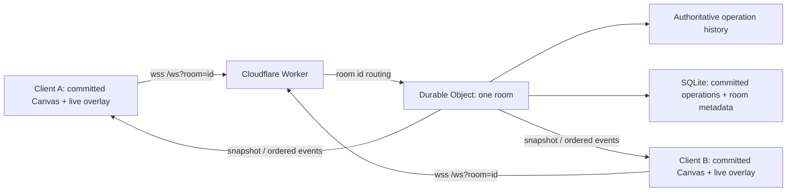

# Loomline - delivery blueprint

## Decision

Build the **Real-Time Collaborative Drawing Canvas** assignment as `Loomline`:
a room-scoped, deterministic multiplayer drawing application. The submission will
be deployed on Cloudflare's free Workers/Durable Objects platform and submitted
with a public GitHub repository, a live URL, a short demo video, and clear
architecture documentation.

This is deliberately not a feature-heavy whiteboard clone. The differentiator is
a correct, observable, explainable collaboration model: smooth local drawing,
ordered remote operations, global undo/redo, reconnect recovery, and persistence.

## Fixed technical stack

| Area | Choice | Reason |
| --- | --- | --- |
| Client | Vite + vanilla TypeScript + HTML/CSS | Meets the no-framework requirement and keeps Canvas/DOM work visible. |
| Rendering | Native Canvas 2D API | No drawing library; predictable imperative rendering. |
| Realtime transport | Native browser WebSocket | Minimal, standards-based protocol; no Socket.io abstraction to defend. |
| Realtime backend | Cloudflare Worker + one Durable Object per room | A room has a single authoritative coordinator for sequence and global history. |
| Persistence | Durable Object SQLite storage | Persist committed operations and room metadata without an external database. |
| Testing | Vitest plus Cloudflare's Workers test pool | Unit-test reducer semantics and integration-test room lifecycle. |
| Deployment | Cloudflare Workers static assets + Durable Objects | One deployment, no sleeping container, `wss` endpoint and static client on one origin. |

The assignment says `Node.js + WebSockets`; Workers are an intentional edge
JavaScript-runtime choice rather than a Node process. We will state that plainly
in `ARCHITECTURE.md`, explain the trade-off, and use only web-standard TypeScript
and native WebSockets. The real-time requirements are the priority and this
choice is defensible only because we can explain it precisely.

## Product scope

### Must ship

- Landing page that creates a shareable room URL with a short room id; different
  room ids must be fully isolated Durable Objects with no data crossover.
- Brush and eraser, colour picker, stroke-width control, clear visual tool state.
- Immediate local drawing; remote users see in-progress strokes, not only final strokes.
- Presence list, deterministic participant colours, and remote cursor indicators.
- Server-authoritative ordering of completed strokes.
- Global undo/redo for **completed** operations, visible to every participant.
- Reconnect and room snapshot recovery.
- Mouse, touch, and stylus support; responsive controls.
- Empty, connection/reconnecting, and failed-room states.
- Deployed demo, meaningful tests, documentation, and a recorded walkthrough.

### Only after all must-ship items are verified

- Diagnostics panel: current FPS, WebSocket RTT, connected clients, messages/sec.
- Network-chaos demo control: latency and dropped-message simulation in development.
- Replay mode for the committed event log.
- Checkpointed Canvas snapshots for faster recovery of large histories.
- A small load script that drives multiple synthetic WebSocket clients.

### Explicitly out of scope

- Authentication, billing, external collaboration libraries, Canvas libraries,
  CRDT packages, shapes/text/images, or a generic product dashboard.

## System design

### Rendering model

Each browser owns two Canvas layers:

1. **Committed layer** - deterministic replay of visible, server-confirmed
   operations, in server sequence order.
2. **Live overlay** - local and remote in-progress strokes. This layer is
   cleared/redrawn only when live stroke state changes.

The local stroke is rendered before the first network send. Pointer points are
filtered by a small distance threshold and batched once per animation frame.
This gives responsive drawing while preventing a WebSocket message for every raw
pointer event.

### Protocol and consistency contract

All messages have a `type`, `protocolVersion`, `roomId`, and payload validated
at the boundary. The full protocol will live in `PROTOCOL.md`.

| Message | Direction | Meaning |
| --- | --- | --- |
| `join` / `snapshot` | client -> server / server -> client | Join a room and receive the latest committed state and sequence number. |
| `stroke:start`, `stroke:points`, `stroke:end` | client -> server | Streams a provisional stroke using a client-generated stroke id. |
| `stroke:live` | server -> peers | Broadcasts in-progress drawing for the overlay. |
| `operation:committed` | server -> all | Contains a durable operation with an authoritative increasing sequence number. |
| `history:undo`, `history:redo` | client -> server | Requests a global history transition. |
| `history:changed` | server -> all | Announces the visible operation set/version; clients rebuild committed layer. |
| `cursor`, `presence` | both directions | Ephemeral collaboration state. |
| `error` | server -> client | A recoverable typed error; never an uncaught client crash. |

**Ordering rule:** an operation is durable only after `stroke:end`. The Durable
Object assigns the next sequence, stores the completed stroke in SQLite, and
broadcasts `operation:committed`. The Durable Object is the single coordinator
for that room, so two completed strokes cannot receive the same order.

**Conflict rule:** overlapping strokes are valid composition. Their final visual
stacking is defined by server sequence, not arrival timing on individual clients.
There is no unsupported pixel-merge claim.

**Undo/redo rule:** history is global and server-owned. `undo` creates a
history-state tombstone for the most recent visible completed operation; it never
deletes or mutates the operation log. `redo` removes the newest valid tombstone.
A newly committed operation clears the redo branch. Live strokes cannot be
undone. This is simple enough to demonstrate and defend.

**Reconnect rule:** on reconnection, a client identifies the room and its last
seen sequence. The server returns a snapshot/replay from persistent state, then
continues ordered broadcasts. The client discards events at or below its latest
applied sequence.

## Reliability and platform choices

- Use Durable Object WebSocket hibernation. Idle rooms can hibernate while
  connections remain alive; constructor initialization reloads durable room
  state when needed.
- Persist only completed operations; live strokes are ephemeral. A stalled live
  stroke expires rather than corrupting committed history.
- Keep per-socket metadata (participant id, name, colour) small enough for
  Durable Object WebSocket attachments.
- Never write individual pointer points as independent SQLite rows. A complete
  stroke is one operation record; optional checkpoints are separate records.
- Rebuild a Canvas layer only when it is marked dirty; do not run a permanent
  animation loop.
- Include graceful reconnect UI even though hibernation retains healthy sockets.

## Validation standard

The feature is not complete until all of the following are demonstrated:

- Two browser contexts draw simultaneously and see each other's live strokes.
- Global undo/redo has the same result in every connected client.
- Refreshing/reconnecting restores the same committed canvas.
- A malformed WebSocket payload produces a typed error, not a broken room.
- Mobile touch drawing and desktop controls work.
- The deployed URL works in a fresh browser session.
- The demo shows an actual two-client interaction, reconnect, and global undo.

## Delivery schedule (deadline: 29 July, 15:00 IST)

| Timebox | Outcome | Commit |
| --- | --- | --- |
| 25 Jul | Tooling and deployment skeleton | `chore(scaffold): initialize edge application` |
| 25 Jul | Two-layer Canvas layout and responsive shell | `feat(canvas): add layered canvas surface` |
| 26 Jul AM | Local pointer tools and touch proof | `feat(canvas): add local pointer drawing tools` |
| 26 Jul PM | Room routing, landing page, and presence | `feat(rooms): add isolated room routing` |
| 26 Jul PM | Streamed remote live strokes | `feat(realtime): broadcast live stroke batches` |
| 27 Jul AM | Durable operation ordering and snapshot replay | `feat(history): add durable ordered room operations` |
| 27 Jul PM | Global tombstone-based undo/redo | `feat(history): add global tombstone-based undo redo` |
| 28 Jul AM | Reconnect/hibernate recovery | `feat(resilience): recover rooms after reconnect` |
| 28 Jul AM | Input hardening and abuse limits | `fix(robustness): harden room input boundaries` |
| 28 Jul PM | Measured diagnostics/load evidence, only if core is green | `feat(observability): add runtime metrics baseline` |
| 28 Jul PM | Deployment/documentation completion and audit | `docs(submission): complete delivery guide` |
| 29 Jul before 12:00 | Rehearsal, demo runbook, final proof | `chore(submission): prepare interview rehearsal` |

The 29th is buffer and submission time, not feature-development time.

## Required documents

- `README.md` - live URL, quick start, feature list, multi-user test steps,
  mobile/browser support, limitations, time spent, and honest AI-use note.
- `ARCHITECTURE.md` - diagram, client layers, Durable Object rationale,
  room lifecycle, persistence/reconnect, scaling plan, and trade-offs.
- `PROTOCOL.md` - message schemas, sequence/idempotency contract, invalid-message
  behavior, and examples.
- `DECISIONS.md` - global undo semantics, overlap/conflict policy, Cloudflare
  choice versus Node server, and deferred scale architecture.
- `TESTING.md` - exact automated/manual/deployed commands and actual evidence.
- `AI_USAGE.md` - concise, honest list of where AI assisted and the manual
  verification/understanding performed. No code is retained unless we can explain it.

## Interview readiness rule

Every commit must be small and meaningful. After each feature, write a two or
three sentence note in the pull-request-style commit body or relevant document:
what changed, the invariant it protects, and how it was tested. We will rehearse
the five non-negotiable explanations: rAF batching, room ordering, global
undo/redo, hibernation/reconnect, and why this is not a CRDT.
