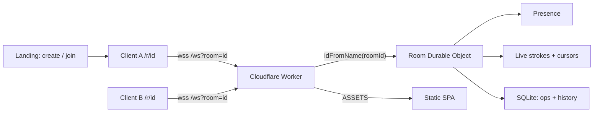
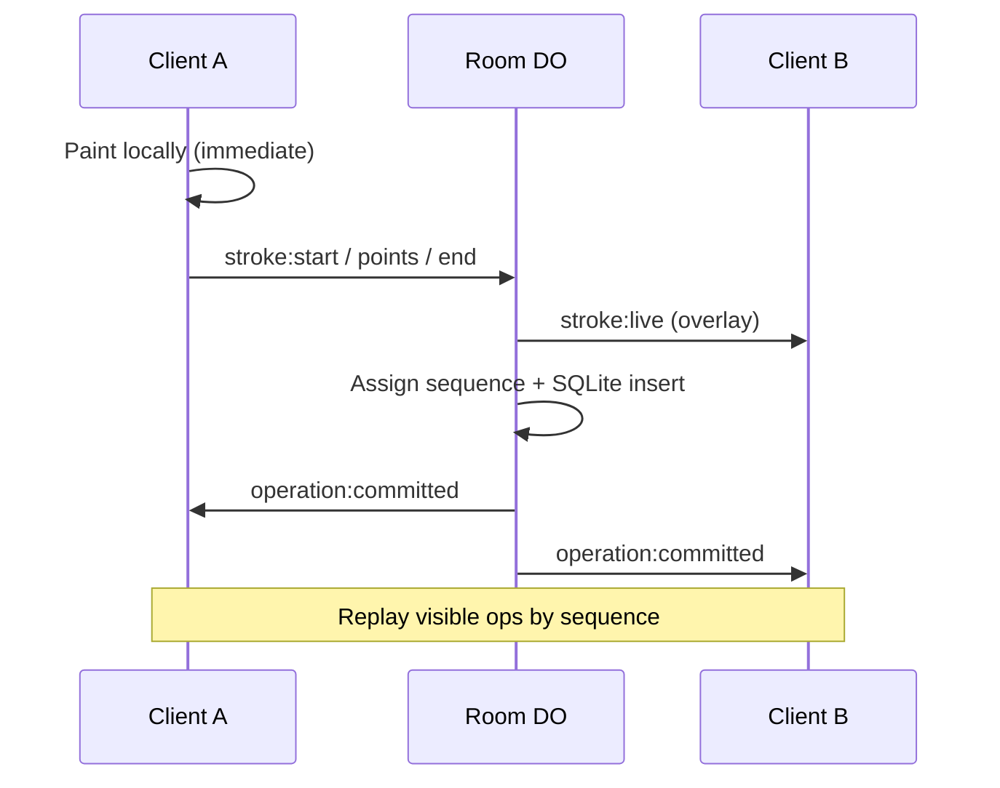

# Loomline

Real-time collaborative drawing canvas — Flam Frontend R&D assignment.

**Live demo:** https://loomline.kolasanivenkat2.workers.dev  
**Repository:** https://github.com/Venkat-Kolasani/Loomline

Vanilla TypeScript + Vite client, native Canvas 2D, native WebSocket. Backend is
a Cloudflare Worker with **one Durable Object per room** and Durable Object
SQLite for committed operations (same-origin `https` + `wss`). Deep rationale:
[docs/DECISIONS.md](./docs/DECISIONS.md) (D1).

Further documentation lives in **[docs/](./docs/)**.

## Architecture





**Invariants (short):** local ink before the network round-trip; only completed
strokes become durable ops; the room DO assigns strictly increasing sequences;
committed canvas = deterministic replay of visible ops; live strokes stay on a
separate overlay; global undo/redo is server-owned over completed ops.

## Features

- Brush, punch-through eraser, shapes (rectangle / ellipse / diamond /
  triangle / star / line / arrow / double arrow; local drag preview → one
  durable commit)
- Colours (presets + picker), brush width slider, eraser size presets
- Live stroke fan-out, remote cursors / collaborator labels, presence list
- Artist name on join; shareable `/r/<roomId>` invite (copy / native share)
- Global undo / redo and room-wide clear (tombstone history; append-only log)
- Reconnect restores committed canvas from `sync_state` (no duplicate sequences)
- Normalized coordinates so peers on different sizes share the same drawing
- Responsive room UI (wide desktop canvas + compact invite/presence bar;
  mobile / tablet shell unchanged)
- Collapsed Metrics dock (Display rAF rate, WS RTT, msg/s — not a Canvas FPS SLA)

## Quick start

Requires **Node.js ≥ 20**.

```bash
git clone https://github.com/Venkat-Kolasani/Loomline.git
cd Loomline
npm ci
npm run typecheck
npm run test
npm run build
npm run dev
```

Open http://127.0.0.1:8787/

| Script | Purpose |
| --- | --- |
| `npm run dev` | Build client + local Worker / Durable Objects |
| `npm run typecheck` | `tsc` for app sources (`client` / `worker` / `shared`) |
| `npm run test` | Vitest (Workers pool) |
| `npm run build` | Production client → `dist/client` |
| `npm run deploy` | Build + deploy to Cloudflare |
| `npm run load` | Synthetic multi-client stroke load (local) |

Production deploys via `npm run deploy` or GitHub Actions on `main`
(`.github/workflows/deploy-cloudflare.yml` with `CLOUDFLARE_API_TOKEN` and
`CLOUDFLARE_ACCOUNT_ID`).

## Multi-user test

1. Open the live URL (or local `npm run dev`).
2. **Client A:** enter a name → **Create room** → confirm **Connected**.
3. Share the room URL; **Client B** joins with a different name.
4. Draw slowly without lifting — peer should see the stroke on the live overlay
   before pointer-up; both keep it after commit.
5. **Undo** / **Redo** on either client — both canvases agree.
6. **Clear room** → confirm; undo restores; refresh reconnects to the same ink.
7. Open a different room id — no cross-room presence or strokes.

Evidence: [docs/TESTING.md](./docs/TESTING.md).

## Browsers

Verified on Chromium (desktop) and physical / emulated mobile touch on the
deployed URL. Mouse and touch PointerEvents are supported.

## Limitations

- Live (in-progress) strokes are not undoable — only committed operations.
- Reconnect uses a full visible snapshot, not a last-sequence delta.
- No auth / accounts / CRDTs / Canvas libraries (by scope).
- Metrics “Display rAF rate” is display cadence, not a Canvas FPS guarantee.

## Time spent

Approximately **3 focused build days** (25–26 July 2026): scaffold through
realtime, history, reconnect, polish, mobile shell, and deploy validation.

## AI assistance

AI assisted drafting of code, tests, and docs. Retained design, failure modes,
and verification are owned by the author. Detail: [docs/AI_USAGE.md](./docs/AI_USAGE.md).

## Assignment compliance

### Frontend

- [x] Brush, eraser, colours, stroke width (+ shapes: rect / ellipse / diamond / triangle / star / line / arrow / biarrow)
- [x] Real-time in-progress strokes
- [x] Remote drawing / cursor indicators
- [x] Stable overlap via server sequence
- [x] Global undo / redo
- [x] Presence + participant colours

### Stack

- [x] Vanilla TypeScript + HTML5 Canvas (no framework / Canvas library)
- [x] Native WebSocket (no Socket.io)
- [x] Cloudflare Worker + Durable Object per room + SQLite persistence

### Challenges

- [x] Efficient Canvas redraw (dirty layers)
- [x] Pointer batching (≤ one network batch per animation frame)
- [x] Committed vs live overlay layers
- [x] Versioned, validated protocol
- [x] Server-authoritative ordering
- [x] Reconnect without duplicate sequences
- [x] Typed recoverable errors

### Submission

- [x] GitHub repository with meaningful commits
- [x] Deployed demo URL
- [x] README setup + multi-user steps
- [x] Mobile / touch drawing verified
- [x] Architecture, protocol, decisions, and test evidence in [docs/](./docs/)

## Docs

| Doc | Link |
| --- | --- |
| Architecture | [docs/ARCHITECTURE.md](./docs/ARCHITECTURE.md) |
| Protocol | [docs/PROTOCOL.md](./docs/PROTOCOL.md) |
| Decisions | [docs/DECISIONS.md](./docs/DECISIONS.md) |
| Testing | [docs/TESTING.md](./docs/TESTING.md) |
| Issues log | [docs/ISSUES.md](./docs/ISSUES.md) |
| AI usage | [docs/AI_USAGE.md](./docs/AI_USAGE.md) |
| Blueprint | [docs/PROJECT_BLUEPRINT.md](./docs/PROJECT_BLUEPRINT.md) |
| Docs index | [docs/README.md](./docs/README.md) |
